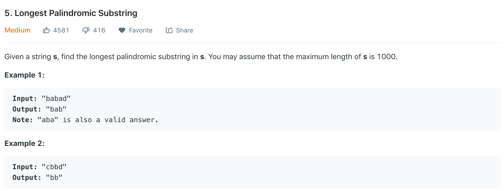

# 5. 最长回文子串



首先，回文指的是正序倒序都相同的字符序列。在此我们尝试用三种方法解决此题：DP，ExpandAroundCenter和Manacher。

## DP

DP是解决此题的一种常规思路。根据回文的定义可知，一个字符串 $$S_{ij}$$ 是回文的条件为：

$$
S_{ij} =\left\{
\begin{aligned}
true & =  \text{substring $S_{i+1, j-1}$ is palindrome && $S_{i} == S_{j}$} \\
false & =  \text{otherwise} 
\end{aligned}
\right.
$$

可以看出这是一个bool类型的状态转移矩阵。例如，如果`bab` 是回文子串，那么`ababa` 肯定也是回文子串，因为 $$S_1 = =a == S_5$$ 且`bab` 是回文子串。为了记录子串是否为回文，我们利用一个数组`dp[n][n]` 来记录子串是否会回文。**整个DP寻找思路可以看成先把子串长度为1或2的初始回文子串找到，然后从子串长度为3开始利用状态转移方程寻找**。时间复杂度和空间复杂度均为 $$O(n^2)$$ ，代码如下：



```c
char* longestPalindrome(char* s) {
    int max_count = 1, len = strlen(s), start = 0;
    if(len < 2)
        return s;
    int dp[len][len]; //记录子串是否为回文
    memset(dp, 0, sizeof(dp));
    
    //先初始化dp,单个字符和一对相等的字符都是回文。相当于先把子串长度为1和2的回文找到。
    for(int i=0; i<len; i++)
    {
        dp[i][i] = 1;
        if(s[i+1] && s[i] == s[i+1])
        {
            dp[i][i+1] = 1;
            max_count = 2;
            start = i;
        }
    }
    
    //从长度为3的子串开始寻找
    for(int sublen=3; sublen<=len; sublen++)
        for(int i=0; i<=len-sublen; i++)
        {
            int j = i+sublen-1;
            if(dp[i+1][j-1] && s[i] == s[j])
            {
                dp[i][j] = 1;
                if(max_count < sublen)
                {
                    max_count = sublen;
                    start = i;
                }
            }
        }
    char *res = (char *)malloc(max_count+1);
    memcpy(res, s+start, max_count);
    res[max_count] = 0;
    return res;
}
               
```



## ExpandAroundCenter

实际上，我们并不需要用一个辅助数组dp来记录子串是否为回文，而是可以从最短的子串开始寻找。其核心思想是**找到一个回文子串的中心点，然后不断向两边扩展直到两边字符不相同**。需要注意的是该中心点可能是一个字符，也可能是两个字符，例如`aba` 的中心点是`a`, `abba` 的中心点则是`bb`。如此则把空间复杂度降为 $$O(n)$$ ，代码如下：



```c
void expandAroundCenter(char *s, int left, int right, int len, int *start, int *max_count)
{
    while(left>=0 && right<=len && s[left] == s[right])
    {
        left--;
        right++;
    }
    if(*max_count < right-left-1)
    {
        *max_count = right-left-1;
        *start = left+1;
    }
}

char* longestPalindrome(char* s) {
    int len = strlen(s), start = 0, max_count =0;
    if(len < 2)
        return s;

    for(int i=0; i<len; i++)
    {
        expandAroundCenter(s, i, i, len, &start, &max_count);
        expandAroundCenter(s, i, i+1, len, &start, &max_count);
    }
    
    char *res = (char *)malloc(max_count+1);
    memcpy(res, s+start, max_count);
    res[max_count] = 0;
    return res;
}
               
```



## Manacher's Algorithm

Manacher算法实际上可以看做是ExpandAroundCenter和DP方法的结合与优化：它基于ExpandAroundCenter的思想，先找到每个回文子串的中心点；同时利用DP的思想，**借助当前判断的子串的对称串（肯定被搜索过）来判断当前子串是否为回文子串**。利用对称子串的信息是Manacher算法的关键，其中可以分为如下两种情况：


